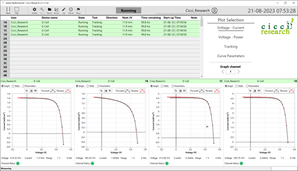

# Software Interface Overview

The ARKEO main window provides an overview of all channels, their measurement status, and the real-time graphs associated with active devices. This page introduces the layout of the interface and explains the purpose of its main elements. Understanding the interface helps users follow ongoing measurements and diagnose unexpected behavior during JV scans or tracking.

The images below show the primary sections of the software interface.

---

## Summary Table

At the top of the main window, the summary table displays one row per channel. Each row indicates:

- whether the channel is enabled  
- the assigned user  
- the device name  
- the current measurement mode (JV scan, tracking, idle, etc.)  
- the latest measured JV parameters  
- any warnings or errors reported by the system  

The table updates continuously, allowing multiple users to monitor their channels simultaneously.

---

## Real-Time Graphs

Below the summary table, a set of real-time graphs displays measurement data for the selected channels. The graphs can be switched between several visualizations:

- voltage versus current  
- voltage versus power  
- tracking over time  
- extracted parameters over time  

Four channels are shown together in each graph window, matching the organization of the four-channel SMU hardware. New data points appear as the measurement proceeds, and the full JV curve is updated after each completed scan.

---

## Channel Structure

Each SMU contains four independent channels, and this structure is mirrored in the software. Channels are grouped visually, making it clear which measurements belong to the same SMU board. This helps diagnose issues such as cable problems or contact failures, which often affect an entire group of four channels rather than a single channel.

Channels belonging to different SMUs are displayed in different groups, but they operate independently. Multiple users can control different sets of channels at the same time.

---

## Measurement Status

During a measurement, the interface shows whether the system is performing a JV scan, running maximum power point tracking, waiting for the next JV interval, or standing by. Tracking mode includes updates of the measured voltage, current, and power, along with automatic corrections applied by the control algorithm.

When a JV scan completes, the extracted parameters—such as Voc, Jsc, V_MPP, J_MPP, and fill factor—are added to the parameter graph. This provides immediate feedback about device stability and performance changes over time.

---

## Multichannel and Multi-User Operation

The interface is designed to support simultaneous operation by multiple users. While one user is running experiments, another can configure devices, add channels to the measurement queue, or review previously recorded data. Each user’s data is stored in a separate folder, allowing clean organization of experiments even when several users are active on the same system.

---

## Navigation

For more detailed information on measurement functionality, see:

- [Starting a Measurement](measurement/starting-a-measurement.md)  
- [JV Scan](measurement/jv-scan.md)  
- [Tracking](measurement/tracking.md)  
- [Settings](settings.md)  
- [Data File Structure](data/index.md)

