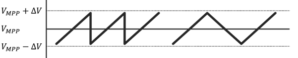

In the tracking phase of the measurement, the device is kept at a specific point (see [the tracking settings](../settings.md/#tracking) for all options). The first JV curve is used as a rough starting point for the tracking phase. For example, if the MPPT option is chosen, the tracking starts with the voltage of the MPP of the JV. The steady-state MPP is often times lower than during a JV, especially with high hysteresis.

## Perturb and Observe 
The MPP of a device is unknown and can change over time. Therefor, a standard control algorithm cannot be used due to the unknown setpoint. Instead, the Perturb and Observe (PAO) algorithm is used. Starting from an initial voltage obtained from the JV, the device is slightly positively and negatively perturbed (ΔV) with respect to active working point. This results in 3 points: V_MPP-ΔV, V_MPP, V_MPP+ΔV. For each point, the device power is recorded, and the voltage associated with the maximum power is set as the new V_MPP. The algorithm is then repeated.

??? warning "Current spikes"
    Jumps in voltage, especially when far from the MPP where the current changes more with changes in voltages, can cause problems in the measurement due to the capacitive effects of many photovoltaic devices. A JV scan stops either at Jsc (when measuring in reverse direction) or at Voc (when measuring in forward direction). A jump in voltage from this point to MPP causes a large current spike as the capacitive effect wears off. To avoid this issue, the Arkeo Multichannel, slowly moves from the last JV point of the scan to the MPP. With a speed (in V/s) according to the JV scan speed. 
    
    Similarly, when oscillating the voltage during the PAO tracking the voltage is moving in a triangle pattern instead of a sawtooth pattern.

    <figure markdown="span">
    
    <figcaption>The PAO used in the Arkeo Multichannel software avoids sharp jumps in voltage (left). Instead, smoother transitions are always used (right).</figcaption>
    </figure>

The disadvantage of the PAO algorithm is the slow response if the MPP has large variation relative to the ΔV, for example when suddenly changing the intensity of the illuminating light source. Moreover, the ΔV must be chosen beforehand by the user, and an optimal value differs per device. Devices with higher VOC require a higher ΔV (choosing a ΔV that is too low compared to the V_MPP can result in the algorithm tracking the noise level of the voltage measurement instead). 

## Fixed setpoint
All other modes have a known setpoint, either in voltage or in current. For these modes, a proportional model is used to maintain the setpoint.

### Fixed Voltage
A standard SMU is not a true potentiostat as it lacks a hardware feedback loop to correct for any voltage drop due to a current flow. Instead this compensation is done in software. By comparing the applied voltage to the actual measured voltage, the difference can be added to the next iteration:
$$
V_{set}(n) = V_{set}(n-1) +  ( V_{setpoint} - V_{measured} )
$$

### Fixed Current
Applying a fixed current is not as trivial as a fixed voltage due to the lack of a hardware galvanostatic mode. The same algorithm is used as in the `Fixed Voltage` mode. In addition, the derivative of the JV curve is used to translate the proportional error in current to the compensation in voltage.
$$
V_{set}(n) = V_{set}(n-1) + \frac{(I_{setpoint} - I_{measured})}{(dI/dV)}
$$

--8<-- "includes/abbreviations.md"