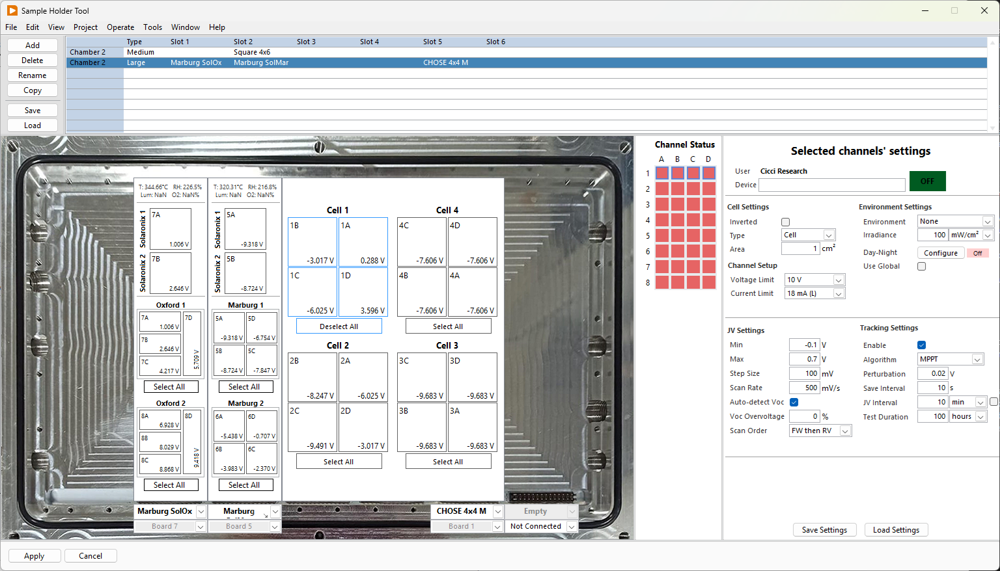

When using a [sample holder](../hardware/sample-holders.md), it can become confusing which devices are connected to which channels. Instead of using the [regular settings](settings.md) window, it is recommended to use the sample holder UI. With this graphical user interface, you can easily select the correct devices without having to worry about associating the correct channel

The holder ui gives a schemetic representation of the physical setup. You can select any number of channels. Changing any setting on the right side will apply them to all selected channels. Refer to [Settings](settings.md) for more details.

If multiple chambers are present, select them from the top table. It is currently not possible to select channel from multiple chambers at the same time.

