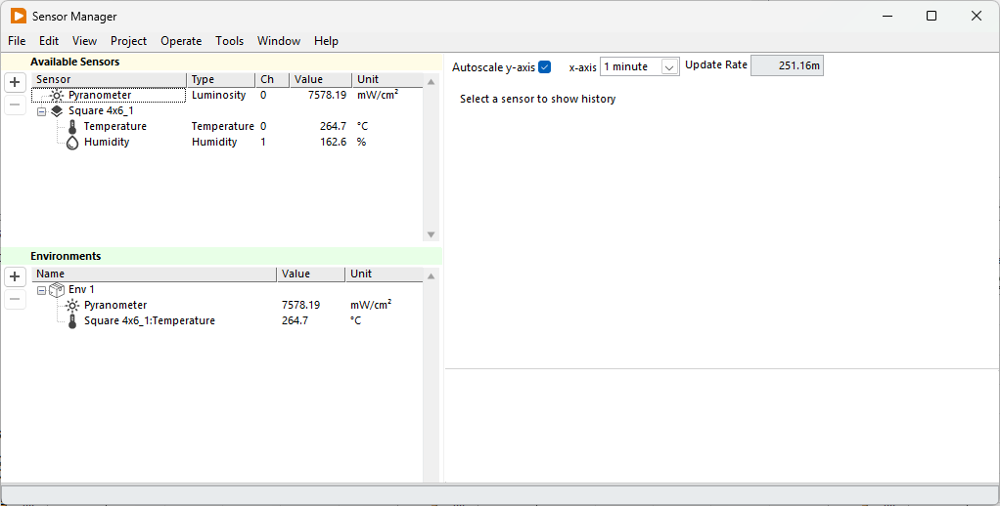
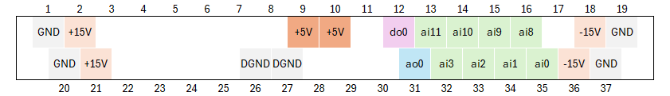

The Arkeo Multichannel software can manage analog and digital sensor as part of the measurements. This allows you to include the environment of the device into the data files. This can be especially important for the irradiance and temperature of the device, which greatly affect its performance.

{ .on-glb }
Sensors are managed in the "Sensor Manager" window. It is accessed from the main window with the "Sensors" button. Here you will see a list of all sensors currently configured for the system. To associate them to your device, see [environments](environments.md).

All sensors save their data at regular intervals to a dedicated save file. See [Data File](data-file.md).

## Managing sensors

Sensors from sample holder (managed by the [sample holder tool](../sample-holder-tool.md)) are added automatically as they are added by the sample holder tool. To add a custom analog sensor, click on the + button and follow the instruction of the wizard.  

Generic sensors are available for the following parameters.

* Temperature
* Humidity
* Irradiance
* Oxygen
* CO2

These sensors can be configured with a gain and offset according the following formula.
$$
\text{value} = V_{in} \cdot \text{gain} + \text{offset}
$$
Sensors with custom conversion functions can be implemented on request.

## Supported Sensors

The following specific sensors are avaible. Custom models can be included on request

### Temperature Sensors

=== "Generic"
    Any generic sensor with the following transfer function
    $$
    T(V) = \text{gain} \cdot V + \text{offset}
    $$

=== "SHT3x-ARP"
    Fully calibrated and linearized temperature sensor
    $$
    T(V) = 218.75 \cdot V/V_{DD} - 66.875
    $$

=== "PT100"
    Measure temperature with the Arkeo PT100 adapter board.

### Humidity Sensors

=== "Generic"
    Any generic sensor with the following transfer function
    $$
    RH(V) = \text{gain} \cdot V + \text{offset}
    $$

=== "SHT3x-ARP"
    Fully calibrated, linearized, and temperature compensated sensor
    $$
    T(V) = 125 \cdot V/V_{DD} - 12.5
    $$

### Luminosity Sensors

=== "Generic"
    Any generic sensor with the following transfer function
    $$
    P(V) = \text{gain} \cdot V + \text{offset}
    $$

=== "Pyranometer"
    A pyranometer is a type of sensor used for measuring solar irradiance designed to measure the solar radiation flux density (W/m2) from the hemisphere above within a wavelength range 0.3 μm to 3 μm. 
    $$
    P(V) = \text{gain} \cdot V
    $$

### Oxygen Sensors

=== "Generic"
    Any generic sensor with the following transfer function
    $$
    O_2(V) = \text{gain} \cdot V + \text{offset}
    $$

### CO2 Sensors

=== "Generic"
    Any generic sensor with the following transfer function
    $$
    CO_2(V) = \text{gain} \cdot V + \text{offset}
    $$

## Sensor Board Pinout

!!! danger "HIGH CURRENT"
    The +15V and +5V outputs can deliver high currents. Ensure a proper connection before turning on the system.

The channel is linked to the sensor board adapters present on the system. To choose the channel, please follow the pinout as shown below.

{ .on-glb }
